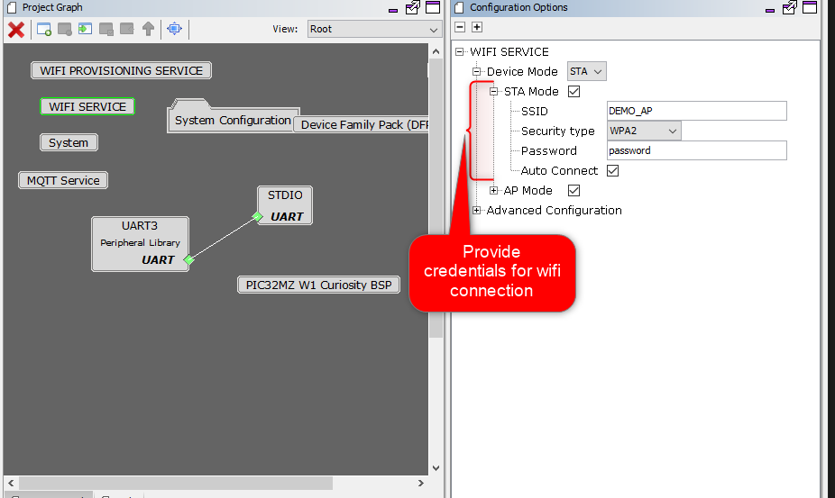
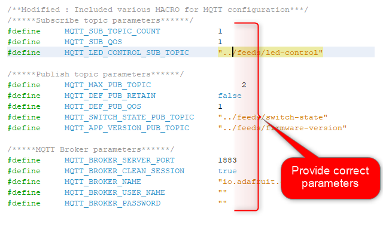
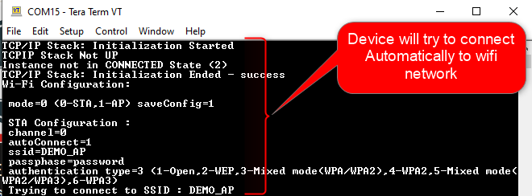

# Demo Application User Guide 
## Description

This is a demo application consisting of OTA service . Application will communicate with user defined MQTT broker and will share informations using user defined MQTT topics. 

## Steps To be followed

1. Provide wifi Credentials:
    . 

2. Please provide the correct parameters in `app_mqtt.h` file as shown in below figure :

    

2. Generate code and compile . 
    ***NOTE: Please Do Not take changes for `app_mqtt.c` & `app_mqtt.h` files, while generating code**

3. Please follow below messages on UART1 console :
    .

5. System will try to connect with user defined MQTT broker.
