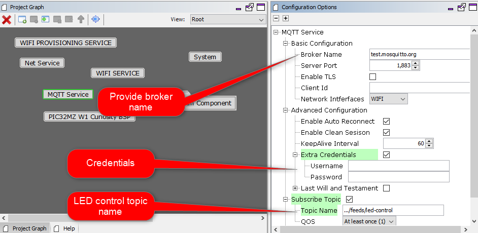
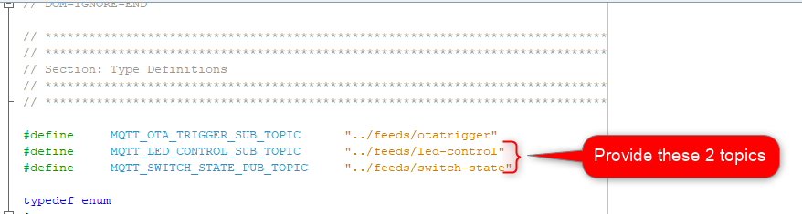
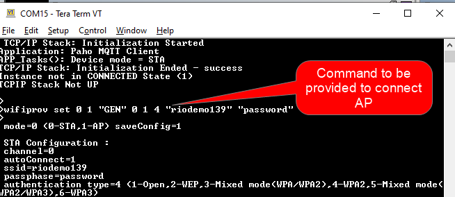

# Demo Application User Guide 
## Description

This is a demo application consisting of OTA service . Application will communicate with user defined MQTT broker and will share informations using user defined MQTT topics. 

## Steps To be followed

1. Please provide the correct parameters as shown in below figure :

    
2. Configure Parameters accordingly as shown in below figure:

    .

3. Generate code and compile .

4. Please follow below messages on UART1 console :
    .

   

5. Please provide below command on UART console :

    `"wifiprov set 0 1 "GEN" 0 1 4 <SSID> <password>`

    example:
    `"wifiprov set 0 1 "GEN" 0 1 4 "riodemo139" "password"`

6. System will try to connect with user defined MQTt broker.
